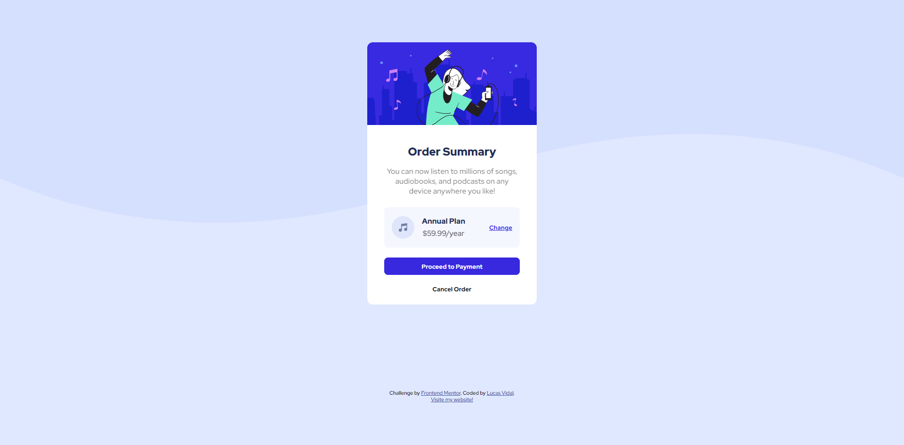

# Frontend Mentor - Order summary card solution

This is a solution to the [Order summary card challenge on Frontend Mentor](https://www.frontendmentor.io/challenges/order-summary-component-QlPmajDUj). Frontend Mentor challenges help you improve your coding skills by building realistic projects. 

## Table of contents

- [Overview](#overview)
  - [The challenge](#the-challenge)
  - [Screenshot](#screenshot)
  - [Links](#links)
- [My process](#my-process)
  - [Built with](#built-with)
  - [What I learned](#what-i-learned)
- [Author](#author)

**Note: Delete this note and update the table of contents based on what sections you keep.**

## Overview

### The challenge

Users should be able to:

- See hover states for interactive elements

### Screenshot
#### Desktop


#### Mobile

#### Active States


### Links

- Solution URL: [GitHub](https://github.com/lvidal-gs/order-summary-component)

## My process

### Built with

- Semantic HTML5 markup
- CSS custom properties
- Flexbox
- CSS Grid

### What I learned

I've learned dearned and reviewed some concepts of the background properties listed below:

```css
body {
    background: url('../images/pattern-background-mobile.svg') no-repeat;
    background: var(--pale-blue);
    font-size: 16px;
    background-size: 100% 50%;
    background-position: top;
    background-color: hsl(225, 100%, 94%);
  }
```
## Author

- Website - [Lucas Vidal](https://lucasvidalweb.web.app/)
- Frontend Mentor - [@lvidal-gs](https://www.frontendmentor.io/profile/lvidal-gs)
- Instagram - [@otaldovidal](https://www.instagram.com/otaldovidal)
